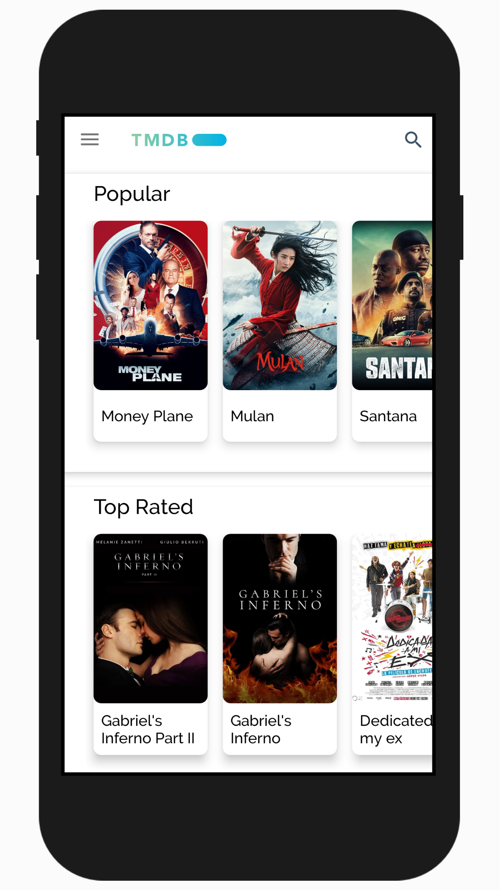
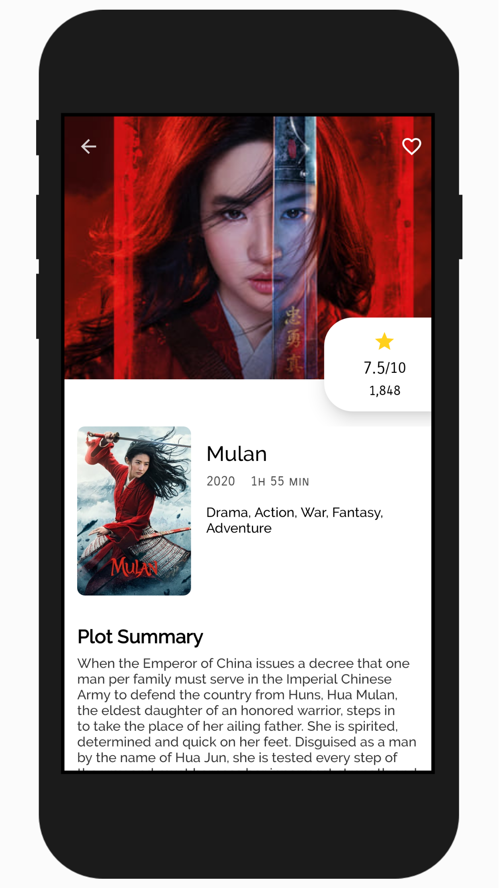
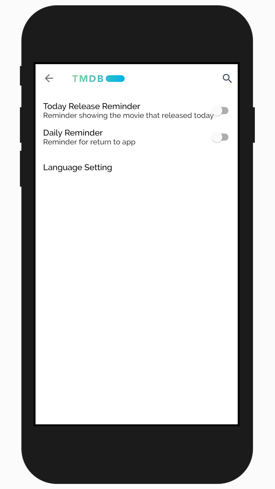
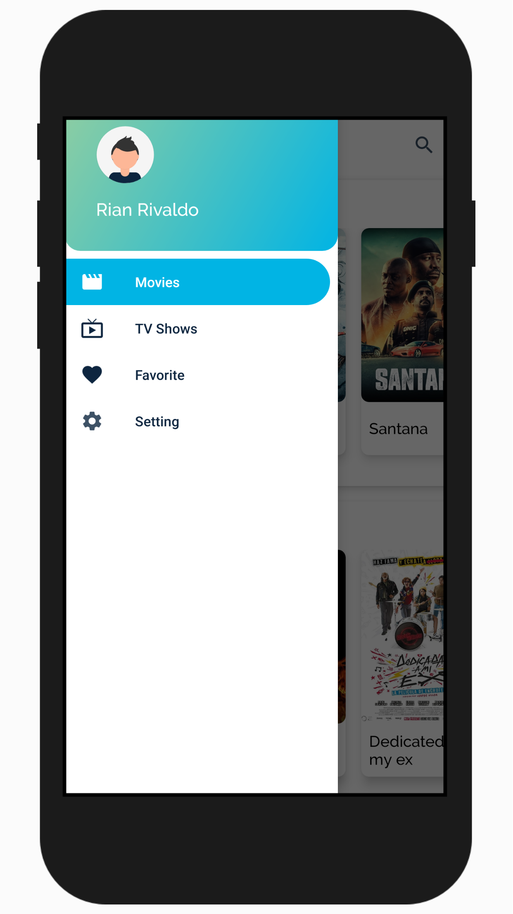
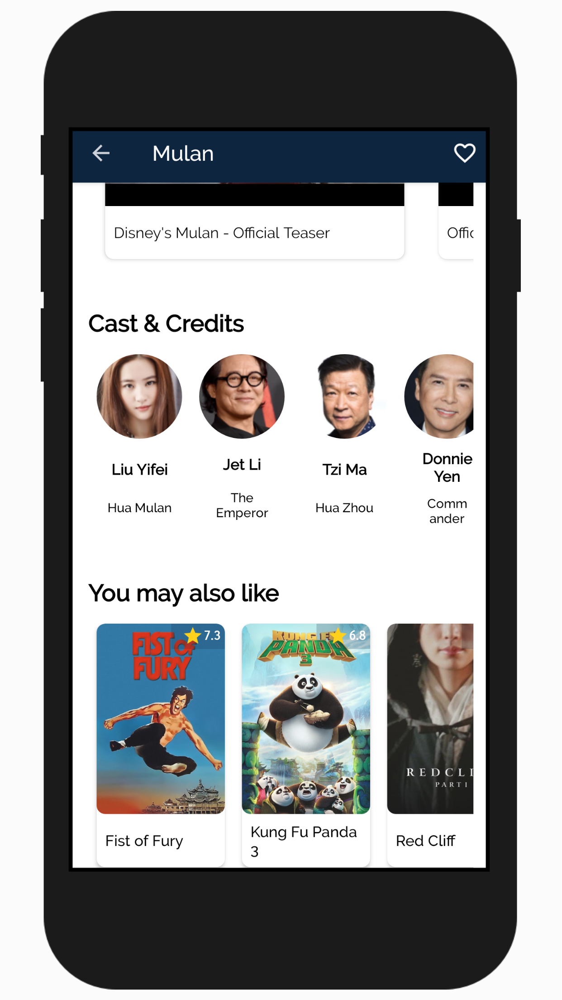
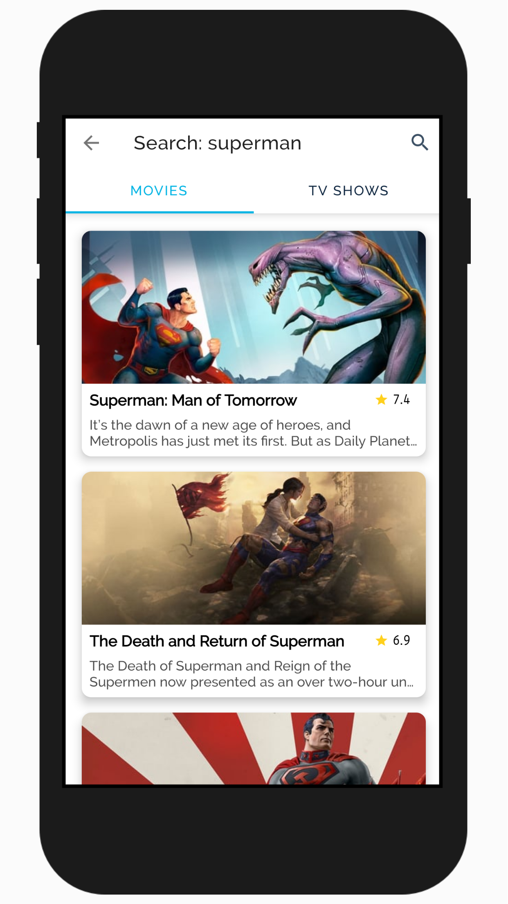
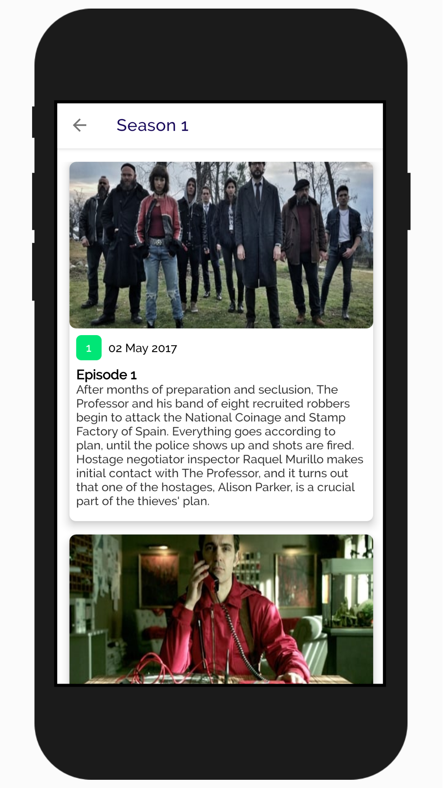

# MOVIE CATALOGUE

Movie catalogue is android application that using some architecture components stuff and fetch API from [TMDB](https://www.themoviedb.org/).
This application can show some movie and tv show that available in [TMDB API](https://developers.themoviedb.org/3). Also user can search some related stuff here.

## Setup project

Get API KEY from [TMDB](https://www.themoviedb.org/). Then create apiKey.properties in root project that contains:
`TMDB_API_KEY="YOUR_API_KEY"`

## Screenshot

## Contributing

Pull requests are welcome. For major changes, please open an issue first to discuss what you would like to change.
